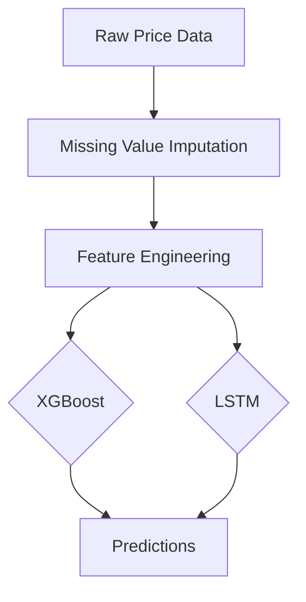

# Crude Oil Price Forecasting Project

## Overview
This project implements machine learning techniques to forecast crude oil prices using historical time series data. The system compares two modeling approaches: XGBoost (gradient boosting) and LSTM (deep learning), providing insights into their relative performance for energy market predictions.

## Features
- **Dual Modeling Approach**: Compare tree-based and neural network methods
- **Comprehensive Evaluation**: RMSE metrics in dollar values and percentage error
- **Visual Diagnostics**: Clear plots of actual vs predicted values
- **Production-Ready Code**: Modular scripts for easy deployment

## Technologies Used
- **Core**: Python 3.8+
- **Data Processing**: Pandas, NumPy
- **Visualization**: Matplotlib
- **Machine Learning**: scikit-learn, XGBoost
- **Deep Learning**: TensorFlow/Keras
- **Development**: Jupyter Notebook, Git

## Installation
```bash
git clone https://github.com/dylankylechua72/crude-oil-forecasting.git
cd crude-oil-forecasting
pip install -r requirements.txt
```

## Usage

### Data Preparation
Add your crude oil price data (Date, Price columns) to `/data/crude_oil_prices.csv`.

Preprocess the data:
```bash
python scripts/data_preprocessing.py
```

### Run Models

- **XGBoost (fast training)**:
  ```bash
  python scripts/xgboost_forecast.py
  ```

- **LSTM (higher accuracy)**:
  ```bash
  python scripts/lstm_forecast.py
  ```
  
### Expected Output
Each script will:
1. Print the RMSE evaluation metric
2. Generate a plot comparing actual vs predicted values
3. Save visualizations to the `results/` directory

## Results

### Model Performance
| Model   | Validation Loss (MSE) | RMSE (Price $) | Training Time | Error %* |
|---------|-----------------------|----------------|---------------|----------|
| XGBoost | -                     | 1.89           | ~30 seconds   | ~3.78%   |
| LSTM    | 6.89 × 10⁻⁵           | 0.42           | ~2 minutes    | ~0.84%   |

\* Assuming crude oil prices range $50-$100. Calculated as:  
`Error % = (RMSE / midpoint price) × 100 = (RMSE / 50) × 100`

### **Performance Comparison**
- **XGBoost**:
  - **RMSE**: $1.89 (~3.78% error)
  - **Training Time**: ~30 seconds
  - **Advantages**: Faster training, suitable for quick iterations, good accuracy for large datasets.

- **LSTM**:
  - **RMSE**: $0.42 (~0.84% error)
  - **Training Time**: ~2 minutes
  - **Advantages**: Higher accuracy, better at capturing complex temporal patterns, stronger model convergence.

### **Conclusion**
LSTM provides superior accuracy with a 4.5× lower error rate than XGBoost, but XGBoost offers faster training times, making it ideal for quick iterations. Choose LSTM for higher precision and XGBoost for speed.

## Technical Details

### Data Pipeline


### Hyperparameters

- **XGBoost**:
  ```python
  XGBRegressor(
      objective='reg:squarederror',
      n_estimators=100,
      learning_rate=0.1
  )
  ```

- **LSTM**:
  ```python
  Sequential([
      LSTM(50, activation='relu'),
      Dense(1)
  ])
  ```

## Future Enhancements
- Real-time API deployment with FastAPI
- Sentiment analysis integration
- Automated hyperparameter tuning
- Ensemble modeling approaches

## Contributing
- Fork the repository
- Create your feature branch (`git checkout -b feature/improvement`)
- Commit your changes (`git commit -am 'Add some feature'`)
- Push to the branch (`git push origin feature/improvement`)
- Open a Pull Request

## For questions or suggestions, please contact:
- Dylan Kyle Chua
- Email: dylanchua.2023@scis.smu.edu.sg
- GitHub: [dylankylechua72](https://github.com/dylankylechua72)
